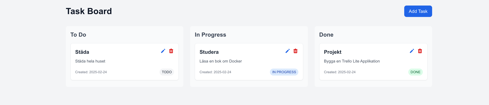

# Task Management Application

A modern, full-stack task management application built with Next.js, FastAPI, and PostgreSQL. Features a drag-and-drop interface for managing tasks across different status columns, similar to Trello.



##  Features

- Drag-and-drop task management
- Real-time status updates
- Clean and modern UI with Tailwind CSS
- RESTful API with FastAPI
- PostgreSQL database for persistent storage
- Docker support for easy deployment
- Responsive design


## 🛠️ Tech Stack

- **Frontend**:
  - Next.js 14
  - React DnD (Drag and Drop)
  - Tailwind CSS
  - TypeScript

- **Backend**:
  - FastAPI
  - SQLAlchemy
  - PostgreSQL
  - Pydantic

- **DevOps**:
  - Docker
  - Docker Compose

##  Running the Application

### Option 1: Using Docker (Recommended)

If you have Docker installed, this is the easiest way to run the application:

1. Clone the repository:
   ```bash
   git clone https://github.com/yourusername/task-management-app.git
   cd task-management-app
   ```

2. Start the application:
   ```bash
   docker-compose up
   ```

3. Access the application:
   - Frontend: http://localhost:3000
   - Backend API: http://localhost:8000
   - API Documentation: http://localhost:8000/docs

### Option 2: Without Docker

#### Prerequisites
- Python 3.11+
- Node.js 20+
- PostgreSQL 15+

#### Backend Setup

1. Create a Python virtual environment:
   ```bash
   cd backend
   python -m venv venv
   source venv/bin/activate  # On Windows: venv\Scripts\activate
   ```

2. Install dependencies:
   ```bash
   pip install -r requirements.txt
   ```

3. Set up PostgreSQL:
   - Create a database named `taskdb`
   - Update the `DATABASE_URL` in `src/database.py` if needed

4. Start the backend:
   ```bash
   cd src
   uvicorn main:app --host 0.0.0.0 --port 8000 --reload
   ```

#### Frontend Setup

1. Install dependencies:
   ```bash
   cd frontend
   npm install
   ```

2. Update the API URL:
   - Set `NEXT_PUBLIC_API_URL` in `.env.local` to match your backend URL

3. Start the frontend:
   ```bash
   npm run dev
   ```

##  API Documentation

The API documentation is available at http://localhost:8000/docs when running the backend server. Key endpoints include:

- `GET /tasks` - List all tasks
- `POST /tasks` - Create a new task
- `PUT /tasks/{task_id}` - Update a task
- `DELETE /tasks/{task_id}` - Delete a task

##  Future Improvements

- [ ] User authentication
- [ ] Multiple boards
- [ ] Task labels and due dates
- [ ] Collaborative features
- [ ] Mobile app version

## Contributing

Contributions are welcome! Please feel free to submit a Pull Request.


## 👤 Author

  Osman M
- GitHub: [Github](https://github.com/bendarte)
- LinkedIn: [LinkedIn](https://linkedin.com/in/osman-m-b646aa295)

